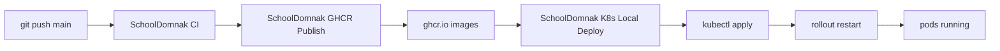

# School-domnak

School management system with a **Nuxt** frontend, **FastAPI** backend, **PostgreSQL**, **Redis**, **Celery**, **Telegram bot**, and **Nginx**.

**Repository:** https://github.com/Kimheang-code-IT/School-domnak.git

---

## Automatic deploy flow (push to `main`)



1. Push code to `main`.
2. **CI** (GitHub-hosted): validate Compose + Kubernetes manifests, build images — no push.
3. **GHCR Publish** (GitHub-hosted): push images to `ghcr.io/kimheang-code-it/*`.
4. **K8s Local Deploy** (self-hosted runner on your PC): apply manifests to **Docker Desktop Kubernetes**, restart deployments, show pods/services.

Only **nginx** uses `LoadBalancer`. Postgres, Redis, backend, frontend, celery, and telegram are **ClusterIP** (internal only).

---

## Workflows

| File | Runner | Trigger |
|------|--------|---------|
| `.github/workflows/ci.yml` | `ubuntu-latest` | Push/PR `main` |
| `.github/workflows/ghcr-publish.yml` | `ubuntu-latest` | Push `main`, manual |
| `.github/workflows/k8s-local-deploy.yml` | `self-hosted` | After GHCR publish OK, manual |

GHCR images:

- `ghcr.io/kimheang-code-it/schooldomnak-backend`
- `ghcr.io/kimheang-code-it/schooldomnak-frontend`
- `ghcr.io/kimheang-code-it/schooldomnak-celery-worker`
- `ghcr.io/kimheang-code-it/schooldomnak-celery-beat`
- `ghcr.io/kimheang-code-it/schooldomnak-telegram-bot`

Publish uses built-in **`GITHUB_TOKEN`** (no Docker Hub).

---

## One-time setup

### 1. Docker Desktop Kubernetes

1. Open **Docker Desktop**.
2. **Settings** → **Kubernetes** → enable **Kubernetes** → **Apply**.
3. Wait until Kubernetes shows **Running**.
4. Confirm context:

```bash
kubectl config current-context
kubectl cluster-info
kubectl get nodes
```

Expected context is often `docker-desktop`.

### 2. Project folder and `.env`

Example path:

```text
D:\project\School Domnak
```

```bash
cp .env.example .env
# Edit .env — never commit .env
mkdir -p secrets uploads
```

### 3. Kubernetes secret (required once)

```bash
kubectl apply -f deploy/kubernetes/namespace.yaml
kubectl create secret generic school-secrets -n schooldomnak --from-env-file=.env
```

See `deploy/kubernetes/secret.example.yaml` for keys. Do not commit real secrets.

Optional: copy Google service account JSON into a Kubernetes secret if you use Sheets backup.

### 4. GHCR login on your machine (for manual pulls)

The deploy workflow logs in automatically. For manual testing:

```bash
echo YOUR_GITHUB_PAT | docker login ghcr.io -u YOUR_GITHUB_USERNAME --password-stdin
```

Use a PAT with `read:packages` if pulling private images outside Actions.

Ensure GHCR packages are linked to this repository (**Packages** → package → **Manage Actions access**).

### 5. Self-hosted GitHub Actions runner

1. GitHub → **Kimheang-code-IT/School-domnak** → **Settings** → **Actions** → **Runners**.
2. **New self-hosted runner** → choose **Windows** or **Linux**.
3. Run the download/config commands GitHub shows.
4. Start the runner and keep it running:

**Windows:**

```bat
run.cmd
```

**Linux:**

```bash
./run.sh
```

The runner must stay online on the **same machine** as Docker Desktop Kubernetes.

### 6. kubectl check before first deploy

```bash
kubectl get ns
kubectl apply -f deploy/kubernetes/namespace.yaml --dry-run=client
kubectl get secret school-secrets -n schooldomnak
```

---

## Test auto deploy

```bash
git add .
git commit -m "test auto deploy"
git push origin main
```

### Check results

1. **GitHub** → **Actions**
   - **SchoolDomnak CI** — green
   - **SchoolDomnak GHCR Publish** — green
   - **SchoolDomnak K8s Local Deploy** — green (self-hosted)
2. **kubectl**:

```bash
kubectl get pods -n schooldomnak
kubectl get svc -n schooldomnak
```

3. Open the app via nginx LoadBalancer:

```bash
kubectl get svc school-nginx -n schooldomnak
```

Docker Desktop usually assigns `localhost` and a port on `EXTERNAL-IP` / `localhost` for LoadBalancer.

---

## Manual Kubernetes deploy

```bash
kubectl apply -f deploy/kubernetes/namespace.yaml
kubectl apply -f deploy/kubernetes/configmap.yaml
kubectl apply -f deploy/kubernetes/postgres/
kubectl apply -f deploy/kubernetes/redis/
kubectl apply -f deploy/kubernetes/backend/
kubectl apply -f deploy/kubernetes/frontend/
kubectl apply -f deploy/kubernetes/celery/
kubectl apply -f deploy/kubernetes/telegram/
kubectl apply -f deploy/kubernetes/nginx/

kubectl rollout restart deployment/school-backend -n schooldomnak
kubectl rollout restart deployment/school-frontend -n schooldomnak
kubectl rollout restart deployment/school-celery-worker -n schooldomnak
kubectl rollout restart deployment/school-celery-beat -n schooldomnak
kubectl rollout restart deployment/school-telegram-bot -n schooldomnak

kubectl get pods -n schooldomnak
kubectl get svc -n schooldomnak
```

---

## Local development (Docker Compose, optional)

Build from source without Kubernetes:

```bash
docker compose up -d --build
docker compose ps
docker compose logs -f backend
docker compose down
```

Folder name is **`Frontend`** (capital F).

---

## Git setup

```bash
git remote set-url origin https://github.com/Kimheang-code-IT/School-domnak.git
git push -u origin main
```

New repo:

```bash
git init
git add .
git commit -m "first commit"
git branch -M main
git remote add origin https://github.com/Kimheang-code-IT/School-domnak.git
git push -u origin main
```

---

## Common errors

| Problem | Fix |
|---------|-----|
| Self-hosted runner **offline** | Start `run.cmd` / `./run.sh` |
| **kubectl** not found | Install kubectl; enable Kubernetes in Docker Desktop |
| `school-secrets` not found | Run `kubectl create secret generic school-secrets -n schooldomnak --from-env-file=.env` |
| **ImagePullBackOff** | GHCR package access; workflow creates `ghcr-pull-secret`; check Actions log for login |
| **CrashLoopBackOff** on backend | Check logs: `kubectl logs deployment/school-backend -n schooldomnak`; verify DATABASE_URL and postgres |
| LoadBalancer **pending** | Normal briefly on Docker Desktop; use `kubectl get svc school-nginx -n schooldomnak` |
| CI fails on frontend | Build path is `./Frontend` not `./frontend` |
| Two Telegram pollers | Only one `school-telegram-bot` deployment |

---

## Security

- Never commit `.env` or real tokens.
- Use `school-secrets` in Kubernetes for sensitive values.
- `GITHUB_TOKEN` is used in workflows for GHCR; no Docker Hub credentials.

---

## Layout

```
.github/workflows/
  ci.yml
  ghcr-publish.yml
  k8s-local-deploy.yml
deploy/kubernetes/
  namespace.yaml
  configmap.yaml
  postgres/ redis/ backend/ frontend/ celery/ telegram/ nginx/
docker-compose.yml          # local dev
docker-compose.prod.yml     # optional compose + GHCR
backend/Dockerfile
Frontend/Dockerfile
```

More detail: `deploy/kubernetes/README.md`.
