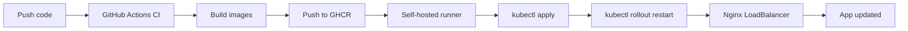

# School-domnak

School management system with a **Nuxt** frontend, **FastAPI** backend, **PostgreSQL**, **Redis**, **Celery**, **Telegram bot**, and **Nginx**.

**Repository:** https://github.com/Kimheang-code-IT/School-domnak.git

---

## Target auto-deploy flow



1. Push to `main`
2. **SchoolDomnak CI** (GitHub-hosted) — validate, build, no push
3. **SchoolDomnak GHCR Publish** (GitHub-hosted) — push to `ghcr.io/kimheang-code-it/*`
4. **SchoolDomnak K8s Local Deploy** (self-hosted on your PC) — `kubectl apply` + rollout restart
5. App available via **school-nginx** LoadBalancer

---

## Workflows

| File | Runner | Trigger |
|------|--------|---------|
| `.github/workflows/ci.yml` | `ubuntu-latest` | Push/PR `main` |
| `.github/workflows/ghcr-publish.yml` | `ubuntu-latest` | Push `main`, manual |
| `.github/workflows/k8s-local-deploy.yml` | `self-hosted` | After GHCR publish OK, manual |

**GHCR images** (tags: `latest` + commit SHA):

- `ghcr.io/kimheang-code-it/schooldomnak-backend`
- `ghcr.io/kimheang-code-it/schooldomnak-frontend`
- `ghcr.io/kimheang-code-it/schooldomnak-celery-worker`
- `ghcr.io/kimheang-code-it/schooldomnak-celery-beat`
- `ghcr.io/kimheang-code-it/schooldomnak-telegram-bot`

Uses **`GITHUB_TOKEN`** only — no Docker Hub.

**Exposure:** only `school-nginx` is `LoadBalancer`. All other services are `ClusterIP` or have no Service.

---

## One-time setup

### 1. Docker Desktop + Kubernetes

1. Open **Docker Desktop** — keep it **running**.
2. **Settings** → **Kubernetes** → **Enable Kubernetes** → **Apply**.
3. Verify:

```bash
kubectl config current-context
kubectl cluster-info
kubectl get nodes
```

### 2. Project folder and `.env`

```text
D:\project\School Domnak
```

```bash
cp .env.example .env
# Edit .env — never commit .env
mkdir -p secrets uploads
```

### 3. Kubernetes application secret (required once)

```bash
kubectl apply -f deploy/kubernetes/namespace.yaml
kubectl create secret generic school-secrets -n schooldomnak --from-env-file=.env
```

See `deploy/kubernetes/secret.example.yaml` (safe example only).

### 4. GHCR package access

If images are private: GitHub → **Packages** → each `schooldomnak-*` package → allow repo **School-domnak**.

Manual pull (optional):

```bash
echo YOUR_GITHUB_PAT | docker login ghcr.io -u YOUR_GITHUB_USERNAME --password-stdin
```

Or run `.\scripts\setup-ghcr-pull-secret.ps1` (see `scripts/SETUP-CHECKLIST.md`).

### 5. Self-hosted runner (required for auto deploy)

1. https://github.com/Kimheang-code-IT/School-domnak/settings/actions/runners/new?arch=x64&os=win
2. Install runner (e.g. `D:\actions-runner-schooldomnak`).
3. Configure with GitHub `config.cmd` token.
4. **Keep runner running:**

**Windows:**

```bat
cd D:\actions-runner-schooldomnak
.\svc install
.\svc start
```

Or interactive: `run.cmd`

**Linux:** `./run.sh`

Runner must show **Idle** (green) in GitHub → Settings → Actions → Runners.

### 6. Pre-flight checks

```bash
kubectl get ns
kubectl get secret school-secrets -n schooldomnak
kubectl apply -f deploy/kubernetes/namespace.yaml --dry-run=client
```

---

## Test auto deploy

```bash
git add .
git commit -m "test k8s auto deploy"
git push origin main
```

### Confirm on GitHub

**Actions** tab — all green:

1. SchoolDomnak CI  
2. SchoolDomnak GHCR Publish  
3. SchoolDomnak K8s Local Deploy (self-hosted)

### Confirm on cluster

```bash
kubectl get pods -n schooldomnak
kubectl get svc -n schooldomnak
```

All app pods should reach `Running` and `READY 1/1`.

---

## App access

```bash
kubectl get svc school-nginx -n schooldomnak
```

| EXTERNAL-IP | URL |
|-------------|-----|
| `localhost` | http://localhost |
| `<pending>` | Wait 1–2 min, or use port-forward below |

**Port-forward fallback:**

```bash
kubectl port-forward svc/school-nginx 8080:80 -n schooldomnak
```

Open: http://localhost:8080

---

## Deploy every time (automatic vs manual)

**Automatic (normal):** push to `main` — workflows handle everything if the self-hosted runner is online.

**Manual trigger:** GitHub → Actions → **SchoolDomnak K8s Local Deploy** → **Run workflow**.

**Manual kubectl (same as the workflow):**

```bash
kubectl apply -f deploy/kubernetes/namespace.yaml
kubectl apply -f deploy/kubernetes/configmap.yaml
kubectl apply -f deploy/kubernetes/postgres/
kubectl apply -f deploy/kubernetes/redis/
kubectl apply -f deploy/kubernetes/backend/
kubectl apply -f deploy/kubernetes/frontend/
kubectl apply -f deploy/kubernetes/celery/
kubectl apply -f deploy/kubernetes/telegram/
kubectl apply -f deploy/kubernetes/nginx/

kubectl rollout restart deployment/school-backend -n schooldomnak
kubectl rollout restart deployment/school-frontend -n schooldomnak
kubectl rollout restart deployment/school-celery-worker -n schooldomnak
kubectl rollout restart deployment/school-celery-beat -n schooldomnak
kubectl rollout restart deployment/school-telegram-bot -n schooldomnak
kubectl rollout restart deployment/school-nginx -n schooldomnak

kubectl get pods -n schooldomnak
kubectl get svc -n schooldomnak
```

---

## Nginx routing (public entry: school-nginx)

| Path | Target |
|------|--------|
| `/` | Frontend (Nuxt SPA) |
| `/api/` | Backend (`/api/v1/`) |
| `/uploads/` | Backend (media/files) |
| `/_nuxt/` | Frontend static assets |
| `/admin/` | Frontend SPA routes |
| `/docs`, `/health` | Backend |

There is no Django-style `/static/` path; Nuxt uses `/_nuxt/`.

---

## Local development (optional Compose)

```bash
docker compose up -d --build
```

Frontend folder is **`Frontend`** (capital F).

---

## Troubleshooting

| Problem | Fix |
|---------|-----|
| Self-hosted runner **offline** | Start `run.cmd` or `.\svc start` in runner folder |
| **Docker Desktop** not running | Start Docker Desktop |
| **Kubernetes** not enabled | Settings → Kubernetes → Enable |
| `school-secrets` **missing** | `kubectl create secret generic school-secrets -n schooldomnak --from-env-file=.env` |
| **GHCR image private** / pull denied | Package settings → grant repo access; deploy workflow creates `ghcr-pull-secret` |
| **ErrImagePull** / ImagePullBackOff | Wait for GHCR publish; run `setup-ghcr-pull-secret.ps1`; check Actions logs |
| Wrong path **`frontend`** vs **`Frontend`** | CI/build must use `./Frontend` |
| LoadBalancer **pending** | Docker Desktop: wait or `kubectl get svc school-nginx -n schooldomnak` |
| Pods **CrashLoopBackOff** | `kubectl logs deployment/school-backend -n schooldomnak` |
| Backend **cannot connect to PostgreSQL** | Check `DATABASE_URL` in secret matches `school-postgres:5432` |
| Backend **cannot connect to Redis** | Check `REDIS_URL` uses `school-redis:6379` |
| K8s deploy **skipped** | GHCR publish failed or runner offline |
| Two Telegram **409** pollers | Only one `school-telegram-bot` replica |

---

## Security

- `.env` is in `.gitignore` — never commit it.
- Real secrets live in Kubernetes `school-secrets` only.
- No Docker Hub credentials in workflows.

---

## Layout

```
.github/workflows/
  ci.yml
  ghcr-publish.yml
  k8s-local-deploy.yml
deploy/kubernetes/
  namespace.yaml
  configmap.yaml
  secret.example.yaml
  postgres/ redis/ backend/ frontend/ celery/ telegram/ nginx/
backend/Dockerfile
Frontend/Dockerfile
```

See `deploy/kubernetes/README.md` and `scripts/SETUP-CHECKLIST.md`.
